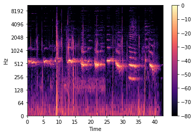
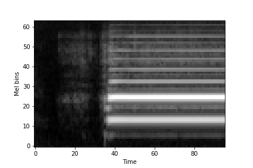
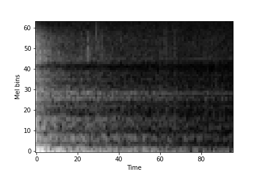
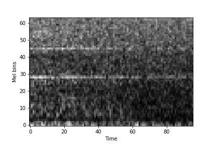
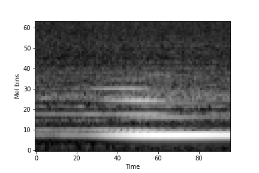

# Project Report #

## Introduction ##

Sound event detection is the task of identifying sounds from a given audio stream along with their temporal start and end times. However, sounds do not occur in isolation which makes it difficult to get isolated samples that generalize well for training. Additionally manually annotating a given audio stream is a time consuming task and often error prone -- resulting in very few datasets of isolated samples or strongly annotated samples. In this project, we work first work on classifying sounds into 1 of 41 labels and then on n of 16 labels i.e. polyphonic sound event detection.

Some other approaches to SED include gaussian mixture models, support vector machines and hierchical models. Hidden markov models are used to detect sounds in the audio stream as well. The deep learning approaches to SED also vary significantly from Recurrent Neural Networks (RNNs) on raw audio stream to Convolutional Neural Networks on spectograms. For this project, I'm following the approach described in the paper Ubicoustics: Plug and Play system.

I chose this task as someone who has difficulty hearing -- a sound event detection technology would take a lot of anxiety out of everyday life. We live in a noisy world, sounds a lot of information we do not think twice about -- alarms, knocking, sirens, honking, microwave beeps, tea kettle whistles and the list goes on. Many of these ahve no visual cues to go with them and thus difficult to notice and identify. Additionally, devices do exist for specific cases (vibrating alarm clocks, flashing doorbell) but it is impractical to have a device for every sound. We are not always in control of our environment so a single technology that can handle many diverse sounds would have much value. This project was also inspired by Sound Watch which in turn used the approach described in Ubicoustics.   

## Data samples ##
To deal with difficulty in recording isolated samples and weakly labelled data, Laput et al curated a training set
on selected sounds from sound effect libraries. The advantages of sound effect libraries are that all available sound effects are atomic i.e. tightly segmented and hundreds of variations of each sound exist, creating a diverse set. Unfortunately, due to licensing agreements existing with the sound effect libraries and the institution (CMU), I wasn't able to get access to this curated dataset. The timeline of this project made it impractical to curate my own dataset from sound effect libraries. Instead, I used the FSDKaggle2018 dataset, consisting of samples from Freesound from [DCASE 2018](http://dcase.community/challenge2018/task-general-purpose-audio-tagging "DCASE 2018"). The challenge for this dataset was "general purpose audio tagging" so each .wav file (3-30 sec in length) in the dataset has been annotated with a single label. The 41 labels are from google's AudioSet Ontology, listed below:

Classes            |	           |
-------------------|---------------|--------
Tearing            | Bus           | Shatter 
Gunshot, gunfire   | Fireworks     | Writing 
Computer keyboard  | Scissors      | Microwave oven
Keys jangling      | Fart          | Squeak 
Knock              | Telephone     | Saxophone
Oboe               | Flute         | Clarinet  
Acoustic guitar    | Tambourine    | Glockenspiel
Finger snapping    | Snare drum    | Bass drum
Burping/eructation | Electric piano| Harmonica 
Trumpet            | Violin/fiddle | Double bass  
Cello              | Gong          | Cough
Laughter           | Applause      | Chime
Drawer open close  | High-hat      | Cowbell
Bark               | Meow          |

## Converting Audio to Images ##
Often times we see plots of sounds, with time as the x axis and pressure as the y axis. Other representations of sound exist, like the fourier transform that takes a signal in the time domain as input and outputs its decomposition into frequencies. Human's ability to hear is focused on small range of frequencies and amplitudes. Converting the frequency to log scale and amplitude to decibels, gives us a spectogram. However, humans ability to hear is not linear --  pairs of sounds that are equidistant to each other on the Hz scale (500 and 1000 Hz vs 7500 and 8000 Hz) do not sound equidistant to humans. So there exists a Mel Scale that is a non-linear transform of the frequency scale. Using this, we create mel spectograms, pictured below. The code for generation of mel spectograms is available through google's audioset [VGGish](https://github.com/tensorflow/models/tree/master/research/audioset/vggish "VGGish"), and has been adapted from there.

 

Algorithm for preprocessing:
- Ensure all wav files are uniform i.e. monochannel, 16-bit depth, same sample rate (16 Hz in Ubicoustics, but 44.1 Hz here). pydub library has several functions that helped with this.
- Then audio is segmented into 960 ms blocks. On each block, Short Time Fourier Transform is computed with 25ms window, 10 ms hop. 
- Mel Fourier Coefficients are calculated by placing into 64 mel bins, and log scaled mel spectogram of 96x64 is generated for each 960 ms of audio. Visualization of the generated spectograms are shown below:

    

Each input feature is actually a numpy array. Notice it is single channel (no color). Sets of 500 are stacked together for ease of access and stored in .npy files and uploaded to google drive.

## Architectures tested: ##
Most pretrainined nets expect 224x224, so in regards to smaller input, we remove last block of convolution. The benefit of transfer learning is being able to use networks pretrained on imagenet.
Vgg11 with 4 blocks instead of 5 (from ubicoustics) insert table
resnet18 (with last block removed, as suggested in ubicoustics) insert image

## Data ##
As mentioned earlier, data was sourced from freesound challenge. The training set consisted of a mix of manually verified and unverified examples. The test set also contained sounds that did not belong to any of the given classes. The challeneg included a csv file listing which files had been manually verified or which files did not belong to any of the given classes. This was used to create 4 dataset combinations were created

dataset breakdown: 
1) freesound train with only manually verified & freesound test without padded examples
2) freesound amplified with amplified examples per class & freesound test without padded examples
3) freesound with all examples in training & freesound test without padded examples
4) freesound with all examples in training & freesound test with 20% unknown examples

Additionally, given dataset was highly imbalanced: 

Class Name			 |	Complete | Amplified | Verified | Test unpadded | Test Padded
---------------------|-----------|-----------|----------|---------------|-------------
Acoustic_guitar      | 3111      | 3111      | 704      | 291           | 291
Applause             | 3488 | 3488 | 496 | 236 | 236
Bark | 2660 | 2660 | 290 | 168 | 168
Bass_drum | 657 | 1971 | 61 | 58 | 58
Burping_or_eructation | 619 | 1857 | 99 | 39 | 39
Bus | 1727 | 1727 | 949 | 433 | 433
Cello | 2181 | 2181 | 675 | 288 | 288
Chime | 1431 | 1431 | 640 | 289 | 289
Clarinet | 2016 | 2016 | 813 | 347 | 347
Computer_keyboard | 1382 | 1382 | 651 | 303 | 303
Cough | 1281 | 1281 | 192 | 68 | 68
Cowbell | 597 | 1791 | 172 | 85 | 85
Double_bass | 908 | 2724 | 230 | 102 | 102
Drawer_open_or_close | 1050 | 1050 | 229 | 138 | 138
Electric_piano | 1536 | 1536 | 932 | 400 | 400
Fart | 1004 | 1004 | 116 | 26 | 26
Finger_snapping | 313 | 939 | 166 | 64 | 64
Fireworks | 2853 | 2853 | 340 | 131 | 131
Flute | 2729 | 2729 | 1018 | 432 | 432
Glockenspiel | 486 | 1458 | 332 | 128 | 128
Gong | 2463 | 2463 | 361 | 160 | 160
Gunshot_or_gunfire | 616 | 1848 | 614 | 221 | 221
Harmonica | 1079 | 1079 | 474 | 162 | 162
Hi-hat | 1006 | 1006 | 186 | 34 | 34
Keys_jangling | 1103 | 1103 | 239 | 81 | 81
Knock | 1079 | 1079 | 203 | 167 | 167
Laughter | 2114 | 2114 | 477 | 154 | 154
Meow | 1094 | 1094 | 274 | 141 | 141
Microwave_oven | 1497 | 1497 | 214 | 169 | 169
None | 0 | 0 | 0 | 0 | 1970
Oboe | 815 | 2445 | 301 | 112 | 112
Saxophone | 1951 | 1951 | 1610 | 691 | 691
Scissors | 936 | 2808 | 530 | 137 | 137
Shatter | 1479 | 1479 | 237 | 60 | 60
Snare_drum | 975 | 2925 | 232 | 20 | 20
Squeak | 2241 | 2241 | 222 | 80 | 80
Tambourine | 520 | 1560 | 120 | 65 | 65
Tearing | 2264 | 2264 | 207 | 153 | 153
Telephone | 963 | 2889 | 881 | 279 | 279
Trumpet | 1623 | 1623 | 529 | 225 | 225
Violin_or_fiddle | 1508 | 1508 | 1070 | 469 | 469
Writing | 2882 | 2882 | 458 | 237 | 237

## Metrics used: ##

Precision = TP/(TP + FP)

Recall = TP/(TP + FN)

Accuracy = (TP + TN)/(TP + FP + TN + FN) --> BUMPED UP BECAUSE OF IMBALANCED CLASSES, large true negatives. Detailed metrics values for each class (accuracy, preision, recall, f1 scores and number of samples) for each run described below can be found in full metrics.csv. 

## Results: ##
initial run with (1) using vgg showed 71% accuracy, but further look at precision and recall showed that some classes were not being learned at all. Precision ranged from 0.2 to 0.9, same for recall. (see full metrics 7.6 test)

insert table of per class accuracy
(1) is very small dataset as well. 

run with all examples in training had much better distribution of per class accuracy
insert graphs of train acc, train loss, test loss, test accuracy
table of per class accuracy

initially froze everything but classifier layers and then unfroze to tune with lower learning rate
on audioset data, ubicoustics achieved 70% accuracy. but like 90 something with sound effect libraries. a significant
limitation of this proejct is not using sound effect data, and size of data (16 hours vs 53 hours)
close enough, better than chnace performance

one of strategies to deal with imbalanced classes: data augmentation. also assists with overfitting (boosted ubicoustics model significantly) -- amplitude change. standard image transforms can't be used on spectograms, so data augmentation consisits of modiying the amplitude of the raw audio file and regeneratign spectograms. chose classes that had < 1000 samples in (3). generated audio file that is 30% louder and 30% softer for these classes and regenerated spectograms. 
run with amplified examples did not show much improvement in per class accuracy, figured oversampling based on same concept would have same results. actually noticed decrease in precision/recall of amplified classes. a theory for this is that in mel spectograms, typically amplitude is the color scale. vgg-ish audio input features are 96x64, no channels for color. however ubicoustics used same code. so not sure where we went wrong?

then moved onto resnet architecture, with (3)
learned much faster, overfit on train set
insert training loss, test loss, train accuracy graph
per class accuracy, precision, recall

playing around with weight decay did not help overfitting much
did resnet perform better? can't say -- dataset limitation

real world deployment --> has lots of unknown classes, has to no when to pick 'none of the above'
used the 'padded' examples in the test set, 20%
taking the best performing vgg and resnet models, selected a confidence threshold for the softmax
and id probs below confidence threshold, classify as none of the above
see results, change in accuracy, per class, recall, precision
accuracy dropped to 57%. while ubicoustics had a drop, it wasn't this big, playing with threshold 
didn't help much

looked into calibration. turns out softmax prediction accuracies aren't always exact. models are overconfident
this gap in calibrartion is problem with deep learning. a solution is temperature scaling, where output is smoothed?
temp is a hyperparameter that can be learned. played around with different values from 0.3 - 1, did not help much

# PART 2: polyphonic sound event detection #
as mentioned earlier, realworld does not contain sounds in isolation. and thus there is another section of sound event detection called 'polyphonic'. wanted to evaluate this method on such dataset.

dataset --> TUT-SED also DCASE. Contains 16 classes that are mixed together synthetically resulting in accurate annotations. need password to get dataset.

datapreprocessing -- same with mel spec generation but now a multilabel classification problem so each sample had multiple labels.

architectures tested: vgg11 with 16 output nodes
the labels were multihot encoded
use sigmoid as final layer
instea dof cross entropy whihc has softmax, use binary cross entropy which has sigmoid

evaluation metrics: for multilable classification, accuracy doesn't make much sense because
each prediction can be partially correct. using a threshold, on the sigmoid output calculate
example based preciison and recall

😥include precision recall curve for all the thresholds, train loss graph, test loss graph
hamming loss?

# future work section: #
curate sound effects dataset for all sounds important to DHH community
mixing augmentations
test even more architectures, lightweight (See diff architectures paper & DJ's paper)
inclusioin of RNN - capturing timeseries, R-CNN hybrid
why spectograms are not good -- datascience article
more work into anomaly detection -- unknown sounds
further testing on polyphonic

note on efficiency, google drive access

