# Project Report #

## Introduction ##

Sound event detection is the task of identifying sounds from a given audio stream along with their temporal start and end times. However, sounds do not occur in isolation which makes it difficult to get isolated samples that generalize well for training. Additionally manually annotating a given audio stream is a time consuming task and often error prone -- resulting in very few datasets of isolated samples or strongly annotated samples. In this project, we work first work on classifying sounds into 1 of 41 labels and then on n of 16 labels i.e. polyphonic sound event detection.

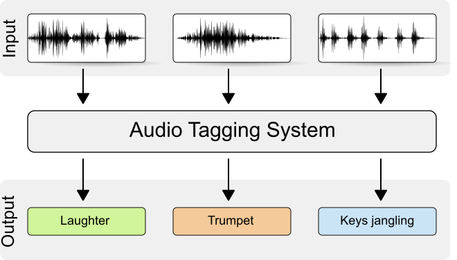

Some other approaches to SED include gaussian mixture models, support vector machines and hierchical models. Hidden markov models are used to detect sounds in the audio stream as well. The deep learning approaches to SED also vary significantly from Recurrent Neural Networks (RNNs) on raw audio stream to Convolutional Neural Networks on spectograms. For this project, I'm following the approach described in the paper Ubicoustics: Plug and Play system.

I chose this task as someone who has difficulty hearing -- a sound event detection technology would take a lot of anxiety out of everyday life. We live in a noisy world, sounds a lot of information we do not think twice about -- alarms, knocking, sirens, honking, microwave beeps, tea kettle whistles and the list goes on. Many of these ahve no visual cues to go with them and thus difficult to notice and identify. Additionally, devices do exist for specific cases (vibrating alarm clocks, flashing doorbell) but it is impractical to have a device for every sound. We are not always in control of our environment so a single technology that can handle many diverse sounds would have much value. This project was also inspired by Sound Watch which in turn used the approach described in Ubicoustics.   

## Data samples ##
To deal with difficulty in recording isolated samples and weakly labelled data, Laput et al curated a training set
on selected sounds from sound effect libraries. The advantages of sound effect libraries are that all available sound effects are atomic i.e. tightly segmented and hundreds of variations of each sound exist, creating a diverse set. Unfortunately, due to licensing agreements existing with the sound effect libraries and the institution (CMU), I wasn't able to get access to this curated dataset. The timeline of this project made it impractical to curate my own dataset from sound effect libraries. Instead, I used the FSDKaggle2018 dataset, consisting of samples from Freesound from [DCASE 2018](http://dcase.community/challenge2018/task-general-purpose-audio-tagging "DCASE 2018"). The challenge for this dataset was "general purpose audio tagging" so each .wav file (3-30 sec in length) in the dataset has been annotated with a single label. The 41 labels are from google's AudioSet Ontology, listed below:

CLASSES            | CLASSES       | CLASSES
-------------------|---------------|--------
Tearing            | Bus           | Shatter 
Gunshot, gunfire   | Fireworks     | Writing 
Computer keyboard  | Scissors      | Microwave oven
Keys jangling      | Fart          | Squeak 
Knock              | Telephone     | Saxophone
Oboe               | Flute         | Clarinet  
Acoustic guitar    | Tambourine    | Glockenspiel
Finger snapping    | Snare drum    | Bass drum
Burping/eructation | Electric piano| Harmonica 
Trumpet            | Violin/fiddle | Double bass  
Cello              | Gong          | Cough
Laughter           | Applause      | Chime
Drawer open close  | High-hat      | Cowbell
Bark               | Meow          |

## Converting Audio to Images ##
Often times we see plots of sounds, with time as the x axis and pressure as the y axis. Other representations of sound exist, like the fourier transform that takes a signal in the time domain as input and outputs its decomposition into frequencies. Human's ability to hear is focused on small range of frequencies and amplitudes. Converting the frequency to log scale and amplitude to decibels, gives us a spectogram. However, humans ability to hear is not linear --  pairs of sounds that are equidistant to each other on the Hz scale (500 and 1000 Hz vs 7500 and 8000 Hz) do not sound equidistant to humans. So there exists a Mel Scale that is a non-linear transform of the frequency scale. Using this, we create mel spectograms, pictured below. The code for generation of mel spectograms is available through google's audioset [VGGish](https://github.com/tensorflow/models/tree/master/research/audioset/vggish "VGGish"), and has been adapted from there.

 

Algorithm for preprocessing:
- Ensure all wav files are uniform i.e. monochannel, 16-bit depth, same sample rate (16 Hz in Ubicoustics, but 44.1 Hz here). pydub library has several functions that helped with this.
- Then audio is segmented into 960 ms blocks. On each block, Short Time Fourier Transform is computed with 25ms window, 10 ms hop. 
- Mel Fourier Coefficients are calculated by placing into 64 mel bins, and log scaled mel spectogram of 96x64 is generated for each 960 ms of audio. Visualization of the generated spectograms are shown below:

    

Each input feature is actually a numpy array. Notice it is single channel (no color). Sets of 500 are stacked together for ease of access and stored in .npy files and uploaded to google drive.

## Architectures tested: ##
In the Ubicoustics paper, they use a variant of the VGG model, specifically configuration A with 11 weight layers. The expected input size for VGG is 224x224, but we have 96x64 input features. With respect to the smaller input size, the last group of convolutional and maxpool layers were dropped. The fully connected layers were modified as well to account for the change in input size. 

The second architecture we tested was ResNet18. Similar modifications were made with respect to the smaller input size (removal of last group of convolutional/maxpool layers, modified fully connected layers).

For training, all layers in vgg.features are initially frozen, and only the classifier is trained for 10 epochs. Then the learning rate is reduced and all parameters are unfrozen to tune the entire model. 

## Data ##
As mentioned earlier, data was sourced from freesound challenge. The training set consisted of a mix of manually verified and unverified examples. The test set also contained sounds that did not belong to any of the given classes. The challenge included a csv file listing which files had been manually verified or which files did not belong to any of the given classes. This was used to create 4 dataset combinations:

1) Verified: freesound train set with only manually verified samples 
2) Complete: freesound with all available samples in training set
2) Amplified: all samples in complete, plus additional augmented amplified samples for some classes
3) Test unpadded: freesound test set with only samples belonging to the 41 classes
4) Test padded: freesound test set padded with 20% unknown samples

The given dataset is highly imbalanced, see graph and table below: 
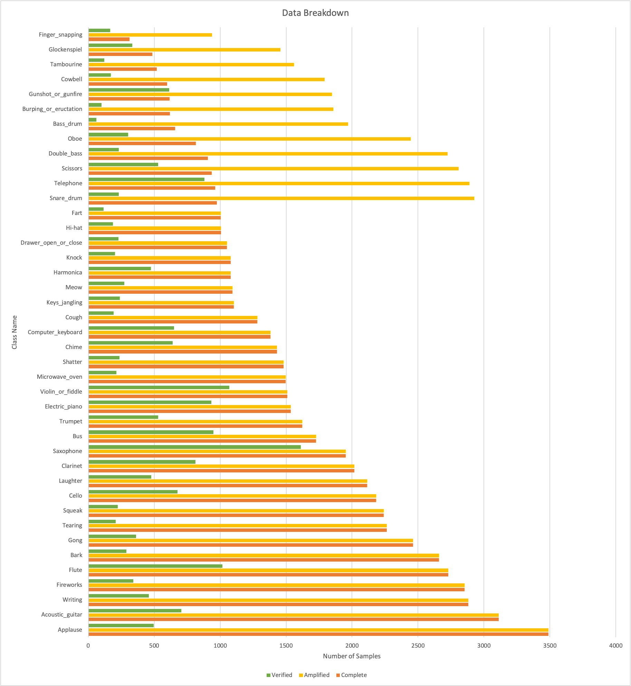

Class Name			 |	Complete | Amplified | Verified | Test unpadded | Test Padded
---------------------|-----------|-----------|----------|---------------|-------------
Acoustic_guitar      | 3111      | 3111      | 704      | 291           | 291
Applause             | 3488 | 3488 | 496 | 236 | 236
Bark | 2660 | 2660 | 290 | 168 | 168
Bass_drum | 657 | 1971 | 61 | 58 | 58
Burping_or_eructation | 619 | 1857 | 99 | 39 | 39
Bus | 1727 | 1727 | 949 | 433 | 433
Cello | 2181 | 2181 | 675 | 288 | 288
Chime | 1431 | 1431 | 640 | 289 | 289
Clarinet | 2016 | 2016 | 813 | 347 | 347
Computer_keyboard | 1382 | 1382 | 651 | 303 | 303
Cough | 1281 | 1281 | 192 | 68 | 68
Cowbell | 597 | 1791 | 172 | 85 | 85
Double_bass | 908 | 2724 | 230 | 102 | 102
Drawer_open_or_close | 1050 | 1050 | 229 | 138 | 138
Electric_piano | 1536 | 1536 | 932 | 400 | 400
Fart | 1004 | 1004 | 116 | 26 | 26
Finger_snapping | 313 | 939 | 166 | 64 | 64
Fireworks | 2853 | 2853 | 340 | 131 | 131
Flute | 2729 | 2729 | 1018 | 432 | 432
Glockenspiel | 486 | 1458 | 332 | 128 | 128
Gong | 2463 | 2463 | 361 | 160 | 160
Gunshot_or_gunfire | 616 | 1848 | 614 | 221 | 221
Harmonica | 1079 | 1079 | 474 | 162 | 162
Hi-hat | 1006 | 1006 | 186 | 34 | 34
Keys_jangling | 1103 | 1103 | 239 | 81 | 81
Knock | 1079 | 1079 | 203 | 167 | 167
Laughter | 2114 | 2114 | 477 | 154 | 154
Meow | 1094 | 1094 | 274 | 141 | 141
Microwave_oven | 1497 | 1497 | 214 | 169 | 169
None | 0 | 0 | 0 | 0 | 1970
Oboe | 815 | 2445 | 301 | 112 | 112
Saxophone | 1951 | 1951 | 1610 | 691 | 691
Scissors | 936 | 2808 | 530 | 137 | 137
Shatter | 1479 | 1479 | 237 | 60 | 60
Snare_drum | 975 | 2925 | 232 | 20 | 20
Squeak | 2241 | 2241 | 222 | 80 | 80
Tambourine | 520 | 1560 | 120 | 65 | 65
Tearing | 2264 | 2264 | 207 | 153 | 153
Telephone | 963 | 2889 | 881 | 279 | 279
Trumpet | 1623 | 1623 | 529 | 225 | 225
Violin_or_fiddle | 1508 | 1508 | 1070 | 469 | 469
Writing | 2882 | 2882 | 458 | 237 | 237

## Metrics used for Evaluation ##

Due to the imbalanced nature of this dataset, accuracy was not the best metric to evaluate performance. 
Accuracy = (TP + TN)/(TP + FP + TN + FN)
Because of the large number of true negatives for each class, the class accuracy does not tell us much.

So we use precision, recall and F1-score.

Precision = TP/(TP + FP)  [What proportion of positive identifications are actually correct?]

Recall = TP/(TP + FN)  [What proportions of actual positives was identified correctly?]

F1-SCORE [Harmonic mean of precision and recall]

Detailed metrics values for each class (accuracy, precision, recall, f1 scores and number of samples) for each run can be found in full metrics.csv. We also list macro-averages of these metrics and micro-averages to estimate full model performance. 

## Results: ##
The first run using VGG architecture and the Verified dataset achieved 97% accuracy on the train set and 73% accuracy on the test set. But a deeper look at precision and recall values for each class showed that some classes were not being learned at all. Precision and recall values ranged from 0.2 to 0.9. (see full metrics 7.6 test)

Metric         | Accuracy  | Precision   | Recall      | F1 SCORE
---------------|-----------|-------------|-------------|-----------------
Micro AVERAGE | 0.98476421 | 0.746515058 | 0.734023333 | 0.732463955
Macro average | 0.98702683 | 0.685114634 | 0.653639024 | 0.65215122
Macro-STDEV   | 0.00741917 | 0.186364477 | 0.211593309 | 0.184094188

The verified dataset contains a total of 18544 samples, ranging from 60 to 1600 samples per class. While training on only the verified sampled has the benefit of strong annotation, the reduced training set size hampered learning significantly. 
 
The next run was using the same VGG architecure and the Complete dataset. This had much better distribution of per class values, with macro-avg recall going up to 0.71. 

Metric         | Accuracy  | Precision   | Recall      | F1 SCORE
---------------|-----------|-------------|-------------|-----------------
Micro AVERAGE  | 0.98621784|0.778676259	 | 0.752659556 | 0.755461749
Macro average  | 0.98794146|0.692556098	 | 0.712363415 | 0.690390244
Macro-STDEV	   | 0.00653808|0.187757712	 | 0.179334153 | 0.164522486

insert graphs of train acc, train loss, test loss, test accuracy
table of per class accuracy

When trained with audioset data, the ubicoustics model achieved 70.5% accuracy and 93.8% when trained with sound effect libraries. A significant limitation of this proejct is not using sound effect data and the size of data (we have 16 hours in our training set, vs 54.6 hours used by ubicoustics). As such, I will interpret precision and recall of approx 0.7 as close to replication and definitely better than chance performance.

One of strategies to deal with imbalanced classes is data augmentation. It also assists with overfitting. In the ubicoustics paper, modifying amplitude and mixing original files with background sounds had a significant positive effect on model performance. Since standard image transforms can't be applied to spectograms, data augmentation consists of modifying the amplitude of the raw audio file and regenerating spectograms. I chose classes that had < 1000 samples in Completed dataset to generate additional samples by generating an audio file that is 30% louder and 30% softer for these classes. The hope was that in addition to adding diversity to the data, we will have slightly more balanced dataset as well. 

However, the run with VGG and Amplified dataset did not show much improvement in per class accuracy for chosen classes. (See full metrics 7.17 and 7.18 and table below). While there was a slight decrease in precision, there is also a slight increase in recall.

Amplified Classes | Added Samples | Comp precision | Comp recall | Amp precision | amp recall | precision change | recall change
------------------|---------------|----------------|-------------|---------------|------------|------------------|---------------
Bass_drum 		  | 1311 | 0.5333 | 0.2759 | 0.551 | 0.4655 | 0.0177 | 0.1896
Burping_or_eructation | 1233 | 0.6809 | 0.8205 | 0.4857 | 0.8718 | -0.1952 | 0.0513
Cowbell | 1185 | 0.831 | 0.6941 | 0.775 | 0.7294 | -0.0559999999999999 | 0.0353
Double_bass | 1789 | 0.7778 | 0.8922 | 0.7769 | 0.9216 | -0.000900000000000012 | 0.0294
Finger_snapping | 625 | 0.814 | 0.5469 | 0.72 | 0.5625 | -0.094 | 0.0155999999999999
Glockenspiel | 972 | 0.3709 | 0.4375 | 0.413 | 0.5938 | 0.0421 | 0.1563
Gunshot_or_gunfire | 1230 | 0.8106 | 0.4842 | 0.7466 | 0.4932 | -0.0639999999999999 | 0.00900000000000001
Oboe | 1617 | 0.792 | 0.8839 | 0.6601 | 0.9018 | -0.1319 | 0.0179
Scissors | 1870 | 0.6293 | 0.5328 | 0.5461 | 0.6058 | -0.0831999999999999 | 0.073
Snare_drum | 1927 | 0.5152 | 0.85 | 0.3529 | 0.9 | -0.1623 | 0.05
Tambourine | 1032 | 0.7818 | 0.6615 | 0.7963 | 0.6615 | 0.0145 | 0
Telephone | 1905 | 0.8545 | 0.5054 | 0.797 | 0.5627 | -0.0575 | 0.0573

Metrics       | Accuracy          | Precision         | Recall            | F1 SCORE
--------------|-------------------|-------------------|-------------------|-------------------
Micro AVERAGE | 0.985896021930384 | 0.775922261889583 | 0.749334323600663 | 0.752631493051128
Macro average | 0.987768292682927 | 0.679790243902439 | 0.721553658536585 | 0.686587804878049
Macro-STDEV   | 0.005961394091334 | 0.185862725963113 | 0.166770694514295 | 0.15348852594758

 a theory for this is that in mel spectograms, typically amplitude is the color scale. vgg-ish audio input features are 96x64, no channels for color. however ubicoustics used same code. so not sure where we went wrong?

Then I moved onto testing ResNet architecture, with the Complete dataset. (See full metrics 7.11). It achieved similar accuary on test set 75%, (VGG achieved 75% as well), resnet was much quicker to overfit on the train set. It reached 99% accuracy by the 17th epoch, VGG only ever got 95% through all training. To help with the overfitting issue, I played around with weight decay which slightly improved performane. (See full metrics 7.13)

Metrics       | Accuracy          | Precision         | Recall            | F1 SCORE
--------------|-------------------|-------------------|-------------------|-------------------
Micro AVERAGE | 0.986214458753028 | 0.776979331888308 | 0.746139844447278 | 0.750848871605253
Macro average | 0.987614634146342 | 0.680868292682927 | 0.700036585365854 | 0.674678048780488
Macro-STDEV   | 0.006696400562078 | 0.211252057314272 | 0.187112902756728 | 0.178823261227664

 
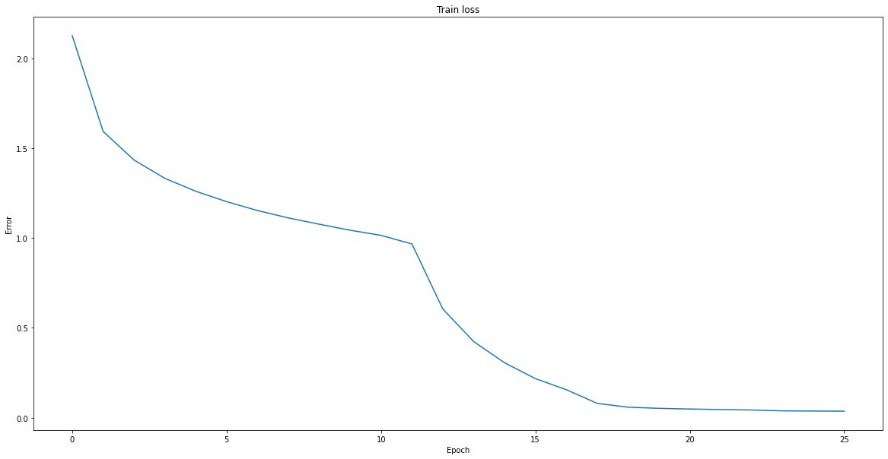 

Did VGG or ResNet perform better? It's hard to say, both achieved similar accuracies on the train set. I believe if we had a balanced dataset for training and testing, we might be able to make better judgements about each model's performance.

The original paper has a section on real world deployment -- the sounds in the real world are not constrained to these 41 classes. There are a lot unknown sounds, even for humans. Any device that is useful in the real world context has to be able to say when the sound does not belong to any of the given classes. To test this real world functionality, I padded the test set with 20% of unknown sounds i.e. sound sthat do not belong to the given categories. I evaluated both the best performing vgg and resnet models on this dataset. 

A threshold was selected for the softmax output of the model, classifications that fell below this 'confidence threshold' were categorized as 'None'. The resulting accuracy for both models was significantly lower -- approximately 57%. In the ubicoustics paper they had a drop in accuracy but it wasn't this large. Modifying values of the confidence threshold did not help improve accuracy much.

looked into calibration. turns out softmax prediction accuracies aren't always exact. models are overconfident
this gap in calibrartion is problem with deep learning. a solution is temperature scaling, where output is smoothed?
temp is a hyperparameter that can be learned. played around with different values from 0.3 - 1, again did not help much

# PART 2: polyphonic sound event detection #
As mentioned earlier, real world does not contain sounds in isolation. Many different sounds occur simultaneously, resulting in this task called polyphonic sound event detection. The original paper did not try this method on polyphonic SED, so I wanted to explore how it performed with a multilabel classification problem instead.

The dataset used for this part is from TUT-SED. It contains sounds from 16 classes that are mixed together synthetically to create polyphony. The result of a synthetic mixture is very accurate annotations. need password to get dataset.

The same preprocessing was applied to the audio files to generate mel spectograms, but now it is multilabel classification problem so each sample has multiple labels.

Architecture tested: same vgg11 model described above but with 16 output nodes
The labels were multihot encoded and sigmoid was used as final layer. Instead of cross entropy loss which has softmax, binary cross entropy loss which has sigmoid was used.

Evaluation Metrics: 
For multilable classification, accuracy doesn't make much sense because each prediction can be partially correct. Using a threshold on the sigmoid output from the model to classify as positive. Then example based preciison and recall and hamming loss were calculated.

Metrics                 | Train set performance 
------------------------|-----------------------
Example based precision | 0.9895581061983265
Example based recall    | 0.936937642413338
Average loss | 0.04090054983378581
Hamming loss | 0.011905640874187832
 
Metric 					| Test set performance 
------------------------|-----------------------
Example based precision | 0.7784662787323723
Example based recall | 0.717024448696244
Average loss | 0.22571873990143987
Hamming loss | 0.07021574440052701

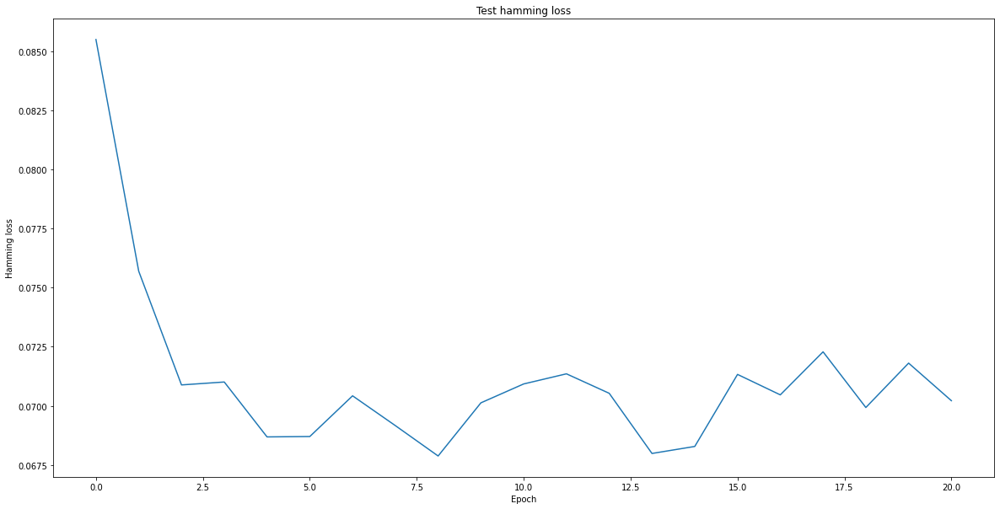 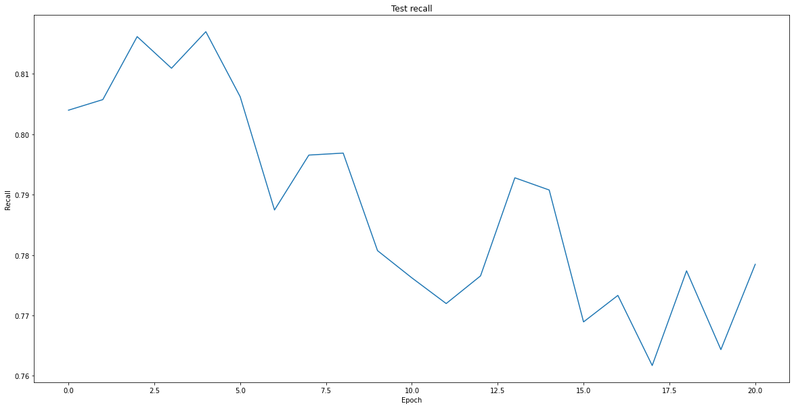 
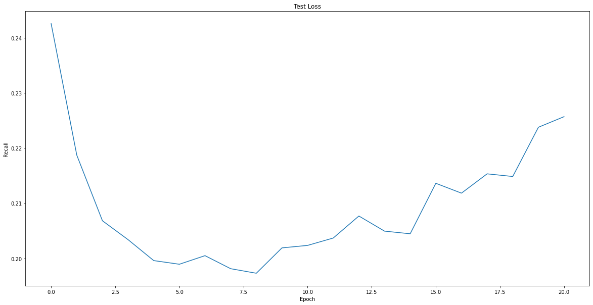 
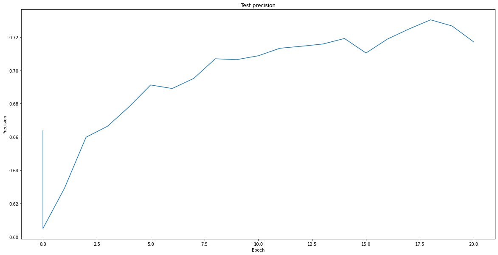 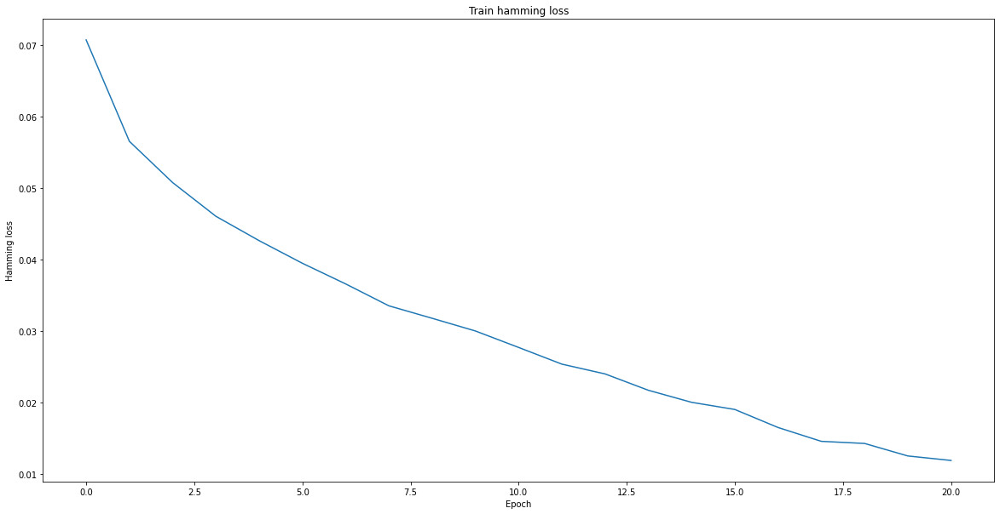 
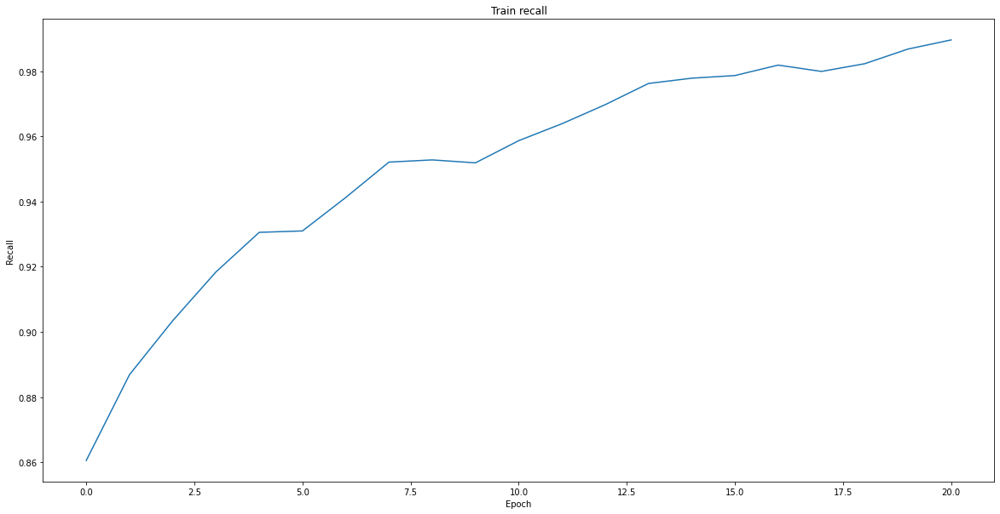 
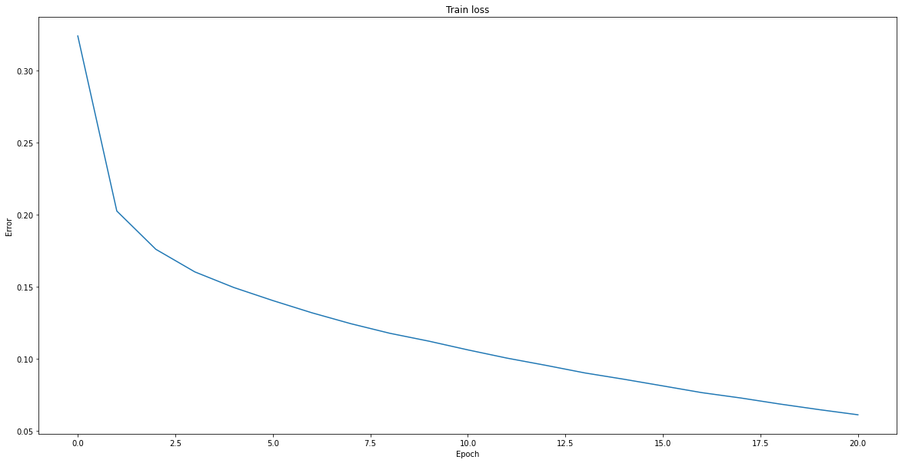 
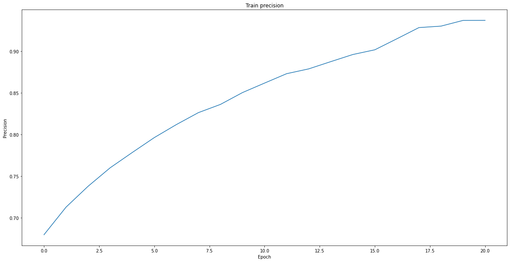 

# future work section: #
curate sound effects dataset for all sounds important to DHH community
mixing augmentations
test even more architectures, lightweight (See diff architectures paper & DJ's paper)
inclusioin of RNN - capturing timeseries, R-CNN hybrid
why spectograms are not good -- datascience article
more work into anomaly detection -- unknown sounds
further testing on polyphonic

note on efficiency, google drive access

