# Sound Event Detection using CNNs - Project Report #

## Table of contents ##
[Introduction](#introduction)

[Data source and labels](#data-source-and-labels)

[Converting Audio to Images](#converting-audio-to-images)

[Architectures Tested](#architectures-tested)

[Datasets](#datasets)

[Metrics Used for Evaluation](#metrics-used-for-evaluation)

[Results](#results)

[Polyphonic Sound Event Detection](#polyphonic-sound-event-detection)

[Future work](#future-work)

[References](#references)

[Code details](#code-details)

## Project Video

[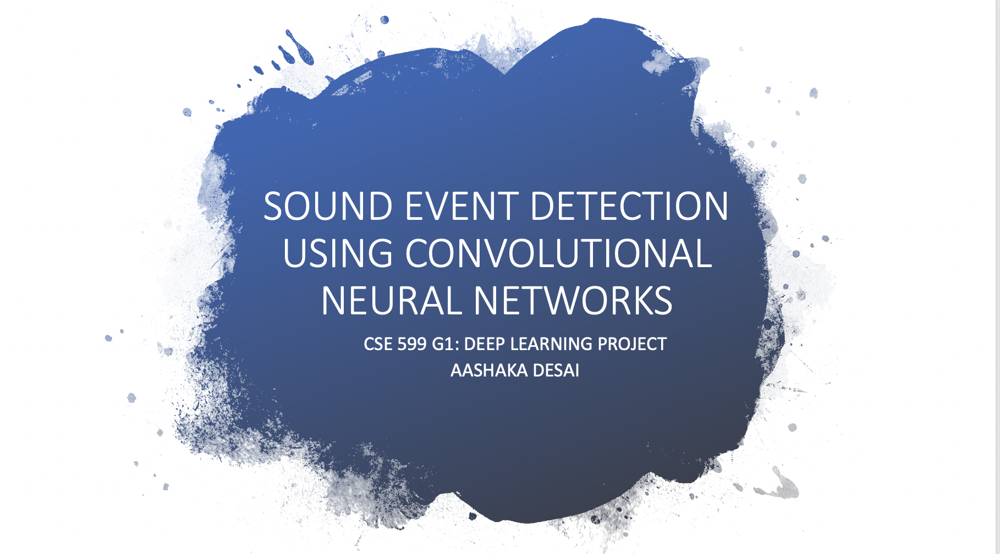](https://youtu.be/2TCgwNLPK6A)

## Introduction ##

Sound event detection (SED) is the task of identifying sounds from a given audio stream along with their temporal start and end times. However, sounds do not occur in isolation, which makes it difficult to get isolated samples that generalize well for training. Additionally, manually annotating a given audio stream is a time-consuming task and often error prone, resulting in very few datasets of isolated samples or strongly annotated samples. In this project, we first work on classifying isolated sounds into 1 of 41 labels and then polyphonic sounds into n of 16 labels i.e. polyphonic SED.

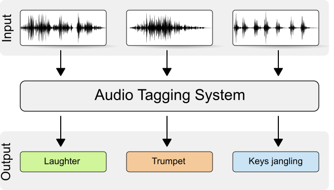
*Source: DCASE 2018 Challenge Website*

Some other approaches to SED include Gaussian Mixture Models, Support Vector Machines and heretical models. Hidden Markov Models are used to detect sounds in the audio stream as well. The deep learning approaches to SED also vary significantly from Recurrent Neural Networks (RNNs) to classify raw audio stream to Convolutional Neural Networks to classify spectrograms. For this project, I am following the approach described in the paper [Ubicoustics: Plug and Play system](#references) paper.

I chose this task as someone who has difficulty hearing -- a sound event detection technology would take a lot of anxiety out of everyday life. We live in a noisy world, sounds convey a lot of information we do not think twice about: alarms, knocking, sirens, honking, microwave beeps, tea kettle whistles and the list goes on. Many of these sounds have no visual cues to accompany them and are thus difficult to notice and identify. Additionally, devices do exist for specific cases (e.g.: vibrating alarm clocks, flashing doorbell) but it is impractical to have a device for every sound. We are not always in control of our environment so a single technology that can handle many diverse sounds would have much value. This project was also inspired by [Home Sound](#references) paper which implements such a SED technology. 

## Data source and Labels ##
To resolve difficulty in recording isolated samples and avoid using weakly labelled data, Laput et al curated a training set
of selected sounds from sound effect libraries. The advantages sound effect libraries bring include the atomic nature (i.e. all sounds are tightly segmented) and diversity (hundreds of variations of each sound exist). Unfortunately, due to licensing agreements existing with the sound effect libraries and the institution (CMU), I wasn't able to get access to this curated dataset. The timeline of this project made it impractical to create my own dataset from sound effect libraries. Instead, I used the FSDKaggle2018 dataset, consisting of samples from Freesound from [DCASE 2018](http://dcase.community/challenge2018/task-general-purpose-audio-tagging "DCASE 2018"). The challenge for this dataset was "general purpose audio tagging", so each .wav file (3-30 sec in length) in the dataset has been annotated with a single label. The 41 labels are from Google’s AudioSet Ontology, listed below:

CLASSES            | CLASSES       | CLASSES
-------------------|---------------|--------
Tearing            | Bus           | Shatter 
Gunshot, gunfire   | Fireworks     | Writing 
Computer keyboard  | Scissors      | Microwave oven
Keys jangling      | Fart          | Squeak 
Knock              | Telephone     | Saxophone
Oboe               | Flute         | Clarinet  
Acoustic guitar    | Tambourine    | Glockenspiel
Finger snapping    | Snare drum    | Bass drum
Burping/eructation | Electric piano| Harmonica 
Trumpet            | Violin/fiddle | Double bass  
Cello              | Gong          | Cough
Laughter           | Applause      | Chime
Drawer open close  | High-hat      | Cowbell
Bark               | Meow          |

## Converting Audio to Images ##
Most people are familiar plots of sounds, with time as the x axis and pressure as the y axis. Other representations of sound exist, such as the Fourier transform that takes a signal in the time domain as input and outputs its decomposition into frequencies. Humans' ability to hear is focused on a small range of frequencies and amplitudes. Converting the frequency to log scale and amplitude to decibels and plotting it gives us a spectrogram. However, humans do not hear linearly --  pairs of sounds that are equidistant to each other on the frequency scale (e.g.: 500 and 1000 Hz vs 7500 and 8000 Hz) do not sound equidistant to humans. So there exists a Mel Scale that is a non-linear transform of the frequency scale. Using this scale, we create Mel spectrograms, pictured below. The code for generation of Mel spectrograms is available through Google's AudioSet [VGGish](https://github.com/tensorflow/models/tree/master/research/audioset/vggish "VGGish") and has been adapted from there.

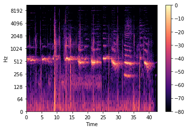 
*Source: [Getting to Know the Mel Spectogram](https://towardsdatascience.com/getting-to-know-the-mel-spectrogram-31bca3e2d9d0)*

Algorithm for preprocessing:
- Ensure all wav files are uniform i.e. monochannel, 16-bit depth, same sample rate (16 Hz in Ubicoustics, but 44.1 Hz here). pydub library has several functions that helped with this.
- Audio is then segmented into 960 ms blocks. On each block, Short Time Fourier Transform is computed with 25ms window, 10 ms hop. 
- Mel Fourier Coefficients are calculated by placing into 64 Mel bins, and log scaled Mel spectrogram of 96x64 is generated for each 960 ms of audio. Visualization of the generated spectrograms are shown below:

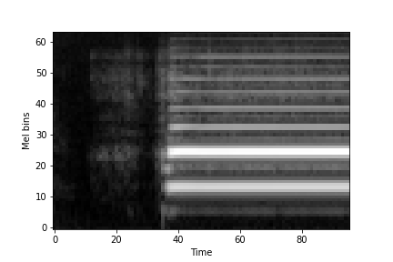 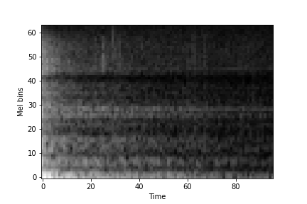 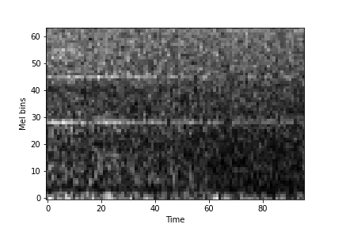 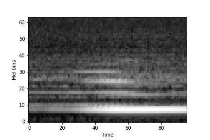 

Each input feature is actually a NumPy array. Notice it is single channel (no color). Sets of 500 are stacked together for ease of access and stored in .npy files and uploaded to google drive.

## Architectures tested ##
In the Ubicoustics paper, they use a variant of the VGG model, specifically configuration A with 11 weight layers. The expected input size for VGG is 224x224, but we have 96x64 input features. With respect to the smaller input size, the last group of convolutional and maxpool layers were dropped. The fully connected layers were modified as well to account for the change in input size. 

The second architecture we tested was ResNet18. Similar modifications were made with respect to the smaller input size (removal of last group of convolutional/maxpool layers, modified fully connected layers).

For training, all layers in vgg.features are initially frozen, and only the classifier is trained for 10 epochs. Then the learning rate is reduced, and all parameters are unfrozen to tune the entire model. 

## Datasets ##
As mentioned earlier, data was sourced from Freesound challenge. The training set consisted of a mix of manually verified and unverified examples. The test set also contained sounds that did not belong to any of the given classes. The dataset includes a csv file listing which files have been manually verified or which files did not belong to any of the given classes. This was used to create 4 dataset combinations for training and testing:

1) Verified: Freesound train set with only manually verified samples 
2) Complete: Freesound with all available samples in training set
2) Amplified: all samples in complete, plus additional augmented amplified samples for certain classes
3) Test unpadded: Freesound test set with only samples belonging to the 41 classes
4) Test padded: Freesound test set padded with 20% unknown samples

The given dataset is highly imbalanced, see graph and table below: 
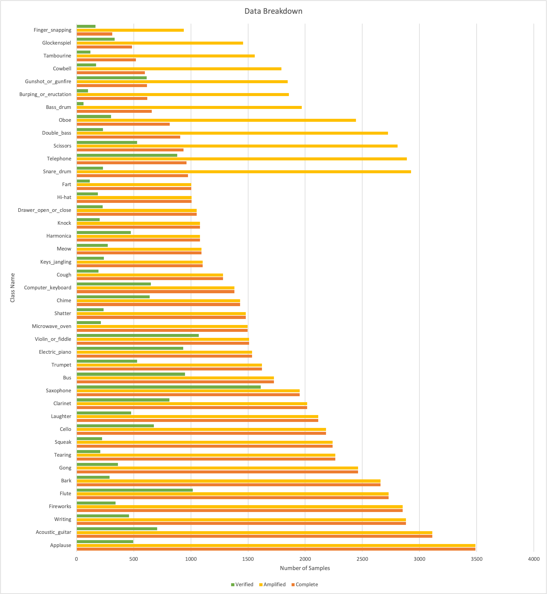

Class Name			 |	Complete | Amplified | Verified | Test unpadded | Test Padded
---------------------|-----------|-----------|----------|---------------|-------------
Acoustic_guitar      | 3111      | 3111      | 704      | 291           | 291
Applause             | 3488 | 3488 | 496 | 236 | 236
Bark | 2660 | 2660 | 290 | 168 | 168
Bass_drum | 657 | 1971 | 61 | 58 | 58
Burping_or_eructation | 619 | 1857 | 99 | 39 | 39
Bus | 1727 | 1727 | 949 | 433 | 433
Cello | 2181 | 2181 | 675 | 288 | 288
Chime | 1431 | 1431 | 640 | 289 | 289
Clarinet | 2016 | 2016 | 813 | 347 | 347
Computer_keyboard | 1382 | 1382 | 651 | 303 | 303
Cough | 1281 | 1281 | 192 | 68 | 68
Cowbell | 597 | 1791 | 172 | 85 | 85
Double_bass | 908 | 2724 | 230 | 102 | 102
Drawer_open_or_close | 1050 | 1050 | 229 | 138 | 138
Electric_piano | 1536 | 1536 | 932 | 400 | 400
Fart | 1004 | 1004 | 116 | 26 | 26
Finger_snapping | 313 | 939 | 166 | 64 | 64
Fireworks | 2853 | 2853 | 340 | 131 | 131
Flute | 2729 | 2729 | 1018 | 432 | 432
Glockenspiel | 486 | 1458 | 332 | 128 | 128
Gong | 2463 | 2463 | 361 | 160 | 160
Gunshot_or_gunfire | 616 | 1848 | 614 | 221 | 221
Harmonica | 1079 | 1079 | 474 | 162 | 162
Hi-hat | 1006 | 1006 | 186 | 34 | 34
Keys_jangling | 1103 | 1103 | 239 | 81 | 81
Knock | 1079 | 1079 | 203 | 167 | 167
Laughter | 2114 | 2114 | 477 | 154 | 154
Meow | 1094 | 1094 | 274 | 141 | 141
Microwave_oven | 1497 | 1497 | 214 | 169 | 169
None | 0 | 0 | 0 | 0 | 1970
Oboe | 815 | 2445 | 301 | 112 | 112
Saxophone | 1951 | 1951 | 1610 | 691 | 691
Scissors | 936 | 2808 | 530 | 137 | 137
Shatter | 1479 | 1479 | 237 | 60 | 60
Snare_drum | 975 | 2925 | 232 | 20 | 20
Squeak | 2241 | 2241 | 222 | 80 | 80
Tambourine | 520 | 1560 | 120 | 65 | 65
Tearing | 2264 | 2264 | 207 | 153 | 153
Telephone | 963 | 2889 | 881 | 279 | 279
Trumpet | 1623 | 1623 | 529 | 225 | 225
Violin_or_fiddle | 1508 | 1508 | 1070 | 469 | 469
Writing | 2882 | 2882 | 458 | 237 | 237

## Metrics used for Evaluation ##

Due to the imbalanced nature of this dataset, accuracy was not the best metric to evaluate performance.

**Accuracy** = (True Positives + True Negatives)/(True Positives + False Positives + True Negatives + False Negatives)
Because of the large number of true negatives for each class, the class accuracy does not tell us much.

So we use precision, recall and F1-score.

**Precision** = True Positives/(True Positives + False Positives)  
[What proportion of positive identifications are actually correct?]

**Recall** = True Positives/(True Positives + False Negatives)  
[What proportions of actual positives was identified correctly?]

**F1-SCORE**  
[Harmonic mean of precision and recall]

Detailed metrics values for each class (accuracy, precision, recall, f1 scores and number of samples) for each run can be found in [Full Metrics.xlsx](Full%20Metrics.xlsx). We also list macro and micro averages of these metrics to estimate full model performance. 

## Results ##
The first run using VGG architecture and the Verified dataset achieved 97% accuracy on the train set and 73% accuracy on the test set. But a deeper look at precision and recall values for each class showed that some classes were not being learned at all. Precision and recall values ranged from 0.2 to 0.9. (see [Full Metrics.xlsx](Full%20Metrics.xlsx) 7.6 test)

Metrics 7.6    | Accuracy  | Precision   | Recall      | F1 SCORE
---------------|-----------|-------------|-------------|-----------------
Micro AVERAGE | 0.98476421 | 0.746515058 | 0.734023333 | 0.732463955
Macro average | 0.98702683 | 0.685114634 | 0.653639024 | 0.65215122
Macro-STDEV   | 0.00741917 | 0.186364477 | 0.211593309 | 0.184094188

The verified dataset contains a total of 18544 samples, ranging from 60 to 1600 samples per class. While training on only the verified sampled has the benefit of strong annotation, the reduced training set size hampered learning significantly. 
 
The next run was using the same VGG architecture and the Complete dataset. This had much better distribution of per class values, with macro-avg recall going up to 0.71. (see [Full Metrics.xlsx](Full%20Metrics.xlsx) 7.3 test)

Metrics 7.3    | Accuracy  | Precision   | Recall      | F1 SCORE
---------------|-----------|-------------|-------------|-----------------
Micro AVERAGE  | 0.98621784|0.778676259	 | 0.752659556 | 0.755461749
Macro average  | 0.98794146|0.692556098	 | 0.712363415 | 0.690390244
Macro-STDEV	   | 0.00653808|0.187757712	 | 0.179334153 | 0.164522486

When trained with AudioSet data, the Ubicoustics model achieved 70.5% accuracy and when trained with sound effect libraries it achieved 93.8% . A significant limitation of this project is not using sound effect libraries for data and the size of data (we have 16 hours in our training set vs 54.6 hours used by Ubicoustics). As such, I will interpret precision and recall of approx. 0.7 as close to replication and definitely better than chance performance.

One of strategies to deal with imbalanced classes is data augmentation. It also assists with overfitting. In the Ubicoustics paper, modifying amplitude and mixing original files with background sounds had a significant positive effect on model performance. Since standard image transforms can't be applied to spectrograms, data augmentation consists of modifying the amplitude of the raw audio file and regenerating spectrograms. I chose classes that had < 1000 samples in Completed dataset to generate additional samples by generating audio files that are 30% louder and 30% softer for these classes. The hope was that in addition to adding diversity to the data, we will have slightly more balanced dataset as well. 

However, the run with VGG and Amplified dataset did not show much improvement in per class accuracy for chosen classes. (See [Full Metrics.xlsx](Full%20Metrics.xlsx) 7.17 and 7.18 and table below). While there was a slight decrease in precision, there is also a slight increase in recall. Perhaps augmenting the entire dataset would have had more noticeable changes.

Amplified Classes | Added Samples | Comp Precision | Comp Recall | Amp Precision | Amp Recall | Precision Change | Recall Change
------------------|---------------|----------------|-------------|---------------|------------|------------------|---------------
Bass_drum 		  | 1311 | 0.5333 | 0.2759 | 0.551 | 0.4655 | 0.0177 | 0.1896
Burping_or_eructation | 1233 | 0.6809 | 0.8205 | 0.4857 | 0.8718 | -0.1952 | 0.0513
Cowbell | 1185 | 0.831 | 0.6941 | 0.775 | 0.7294 | -0.055999 | 0.0353
Double_bass | 1789 | 0.7778 | 0.8922 | 0.7769 | 0.9216 | -0.00090 | 0.0294
Finger_snapping | 625 | 0.814 | 0.5469 | 0.72 | 0.5625 | -0.094 | 0.015599
Glockenspiel | 972 | 0.3709 | 0.4375 | 0.413 | 0.5938 | 0.0421 | 0.1563
Gunshot_or_gunfire | 1230 | 0.8106 | 0.4842 | 0.7466 | 0.4932 | -0.063999| 0.00900
Oboe | 1617 | 0.792 | 0.8839 | 0.6601 | 0.9018 | -0.1319 | 0.0179
Scissors | 1870 | 0.6293 | 0.5328 | 0.5461 | 0.6058 | -0.083199 | 0.073
Snare_drum | 1927 | 0.5152 | 0.85 | 0.3529 | 0.9 | -0.1623 | 0.05
Tambourine | 1032 | 0.7818 | 0.6615 | 0.7963 | 0.6615 | 0.0145 | 0
Telephone | 1905 | 0.8545 | 0.5054 | 0.797 | 0.5627 | -0.0575 | 0.0573

Metrics 7.17  | Accuracy          | Precision         | Recall            | F1 SCORE
--------------|-------------------|-------------------|-------------------|-------------------
Micro AVERAGE | 0.985896021930384 | 0.775922261889583 | 0.749334323600663 | 0.752631493051128
Macro average | 0.987768292682927 | 0.679790243902439 | 0.721553658536585 | 0.686587804878049
Macro-STDEV   | 0.005961394091334 | 0.185862725963113 | 0.166770694514295 | 0.15348852594758

Then I moved onto testing ResNet architecture, with the Complete dataset. (See [Full Metrics.xlsx](Full%20Metrics.xlsx) 7.11). It achieved similar accuracy on test set 75% (same as VGG ), but ResNet was much quicker to overfit on the train set. It reached 99% accuracy by the 17th epoch, VGG only ever got 95%through all training. To help with the overfitting issue, I played around with weight decay which slightly improved performance. (See [Full Metrics.xlsx](Full%20Metrics.xlsx) 7.13)

Metrics 7.13  | Accuracy          | Precision         | Recall            | F1 SCORE
--------------|-------------------|-------------------|-------------------|-------------------
Micro AVERAGE | 0.986214458753028 | 0.776979331888308 | 0.746139844447278 | 0.750848871605253
Macro average | 0.987614634146342 | 0.680868292682927 | 0.700036585365854 | 0.674678048780488
Macro-STDEV   | 0.006696400562078 | 0.211252057314272 | 0.187112902756728 | 0.178823261227664

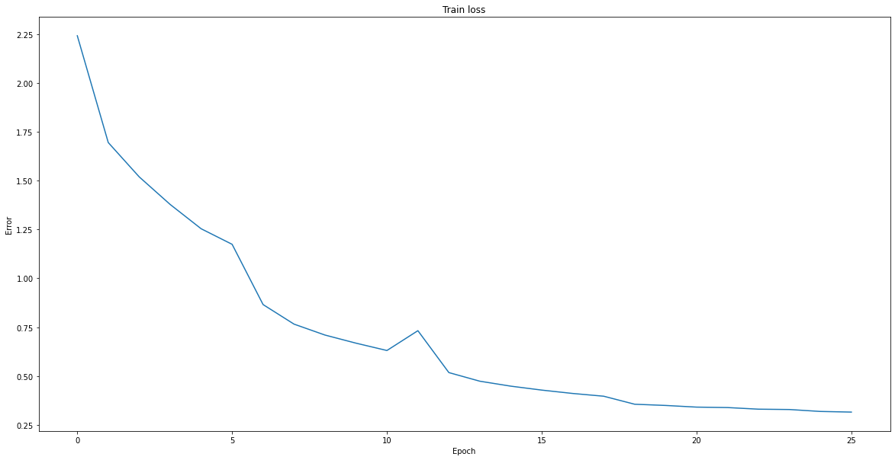
*Train Loss for VGG Model*

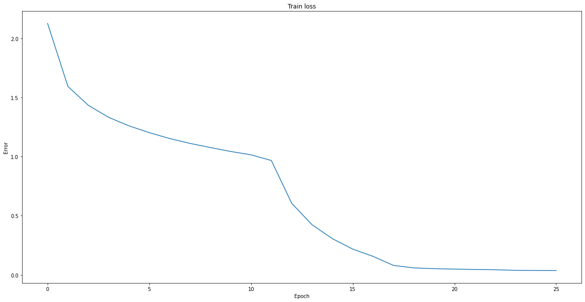
*Train loss for ResNet Model* 

Did VGG or ResNet perform better? It's hard to say, both achieved similar accuracies on the train set. I believe if we had a balanced dataset for training and testing, we might be able to make better judgements about each model's performance.

The original paper has a section on real world deployment -- the sounds in the real world are not constrained to these 41 classes. There are a lot unknown sounds, even for humans. Any device that is useful in the real-world context has to be able to say when the sound does not belong to any of the given classes. To test this real-world functionality, I padded the test set with 20% of unknown sounds i.e. sounds that do not belong to the given categories. I evaluated both the best performing VGG and ResNet models on this dataset. 

A threshold was selected for the softmax output of the model, classifications that fell below this 'confidence threshold' were categorized as 'None'. The resulting accuracy for both models was significantly lower -- approximately 60%. Please check [Google Colab notebook output](Project.ipynb) for details. In the Ubicoustics paper, they had a drop in accuracy (from 70% to 65%) but it wasn't this large. Modifying values of the confidence threshold did not help improve accuracy much.

A potential explanation for this is that for most deep learning models, there is a gap between the output from the SoftMax layer and the true probabilities/confidence for each label. Models tend to be overconfident with their prediction. Resolving this gap between predicted probabilities and true confidence values is called calibration. One way to correctly calibrate a model is temperature scaling. Temperature is a hyperparameter that can be learned but I chose to manually try different values. However accuracy remained at 60%. (see [ Google Colab](Project.ipynb) for output)

# Polyphonic sound event detection #
As mentioned earlier, the real world does not contain sounds in isolation. Many different sounds occur simultaneously, resulting in this task called polyphonic sound event detection. The original paper did not evaluate their method on polyphonic SED, so I wanted to explore how it performed with a multilabel classification problem instead.

The dataset used for this section is from [TUT-SED](https://webpages.tuni.fi/arg/paper/taslp2017-crnn-sed/tut-sed-synthetic-2016 "TUT-SED"). It contains sounds from 16 classes that are mixed together synthetically to create polyphony. The result of a synthetic mixture is very accurate annotations. 

The same [preprocessing](#converting-audio-to-images) was applied to the audio files to generate Mel spectrograms, but now it is multilabel classification problem, so each sample has multiple labels.

Architecture tested: same vgg11 model described [above](#architectures-tested) but with 16 output nodes. 

The labels were multihot encoded and sigmoid was used as final layer. Instead of using cross entropy loss which has softmax, binary cross entropy loss which has sigmoid was used.

Evaluation Metrics: 
For multilabel classification, accuracy doesn't make much sense because each prediction can be partially correct. A threshold was used on the sigmoid output from the model to classify a label as positive. Then example-based precision, recall and hamming loss were calculated.

Hamming Loss = number of incorrectly classified samples / (number of samples x number of labels)

Results:
The model definitely achieved better than chance performance on both training and test set. Please see [Polyphonic.ipynb](Polyphonic.ipynb) for detailed outputs. I believe this technique does generalize to polyphonic detection, but further testing is required to see which architectures work best and which metrics best evaluate real-world performance. 

Metrics                 | Train set performance 
------------------------|-----------------------
Example based precision | 0.9895581061983265
Example based recall    | 0.936937642413338
Average loss | 0.04090054983378581
Hamming loss | 0.011905640874187832
 
Metric 					| Test set performance 
------------------------|-----------------------
Example based precision | 0.7784662787323723
Example based recall | 0.717024448696244
Average loss | 0.22571873990143987
Hamming loss | 0.07021574440052701

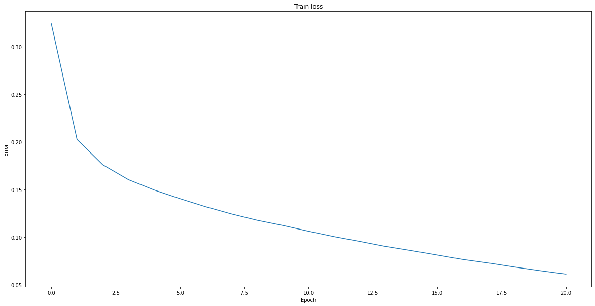 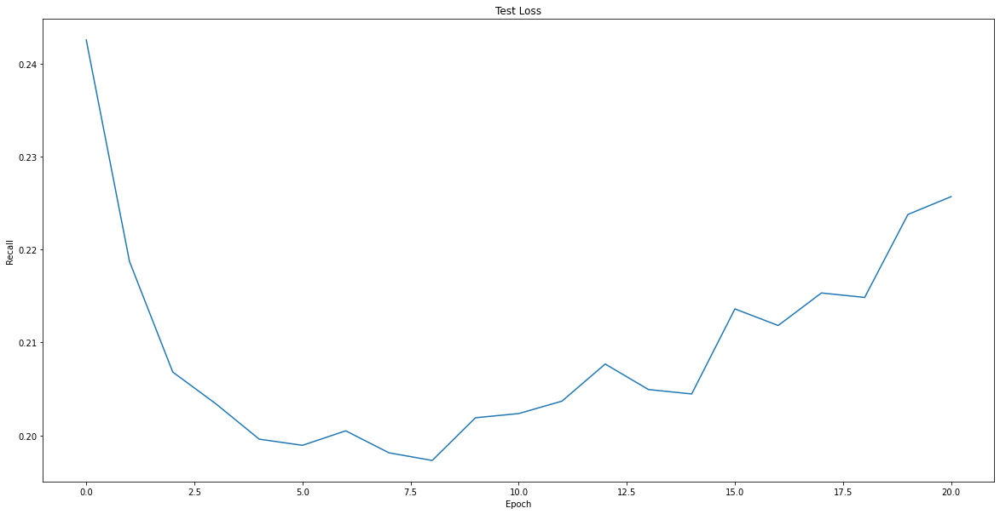
*Left: train loss, Right: test loss*

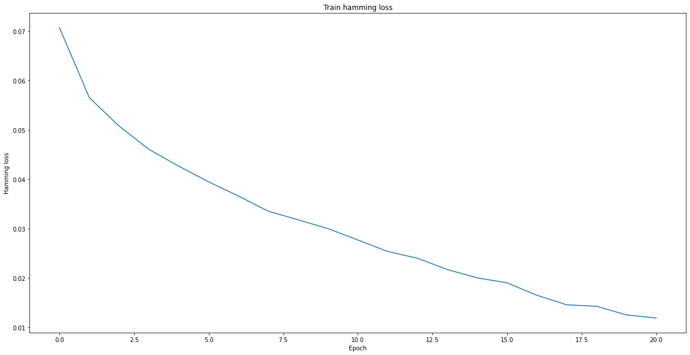 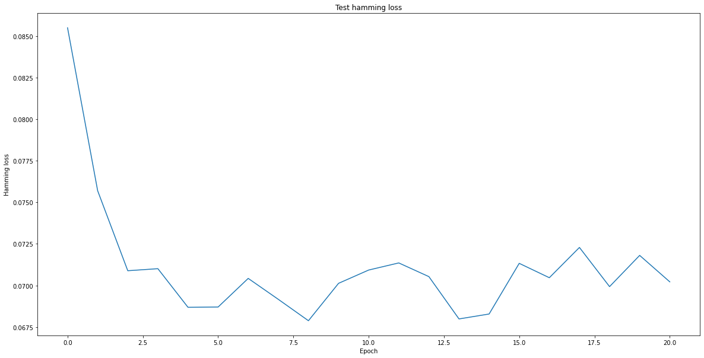 
*Left: train hamming loss, Right: test hamming loss*

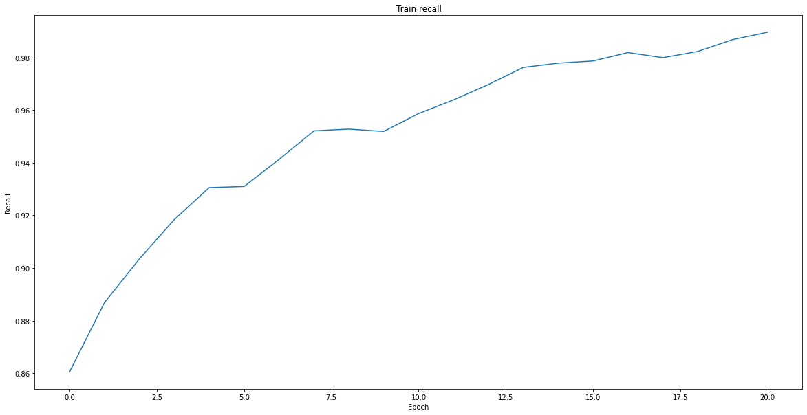 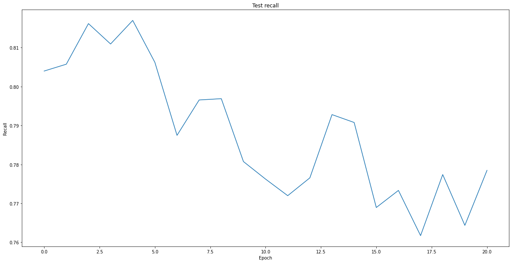 
*Left: train recall, Right: test recall*

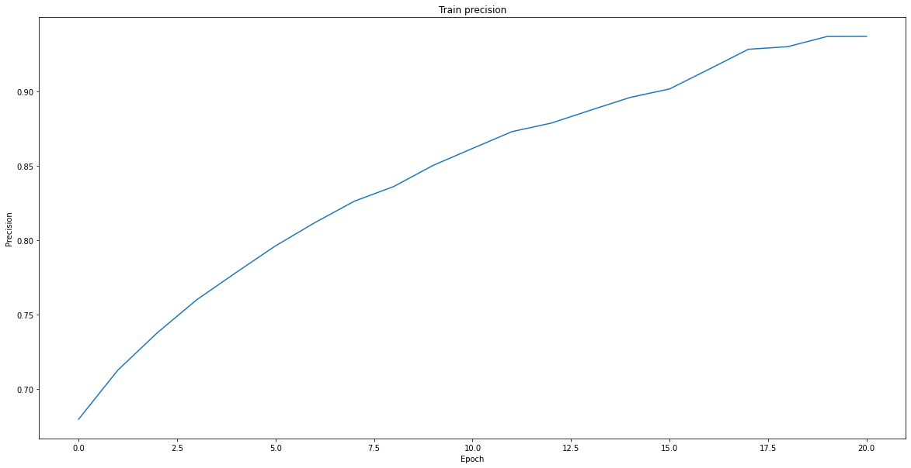 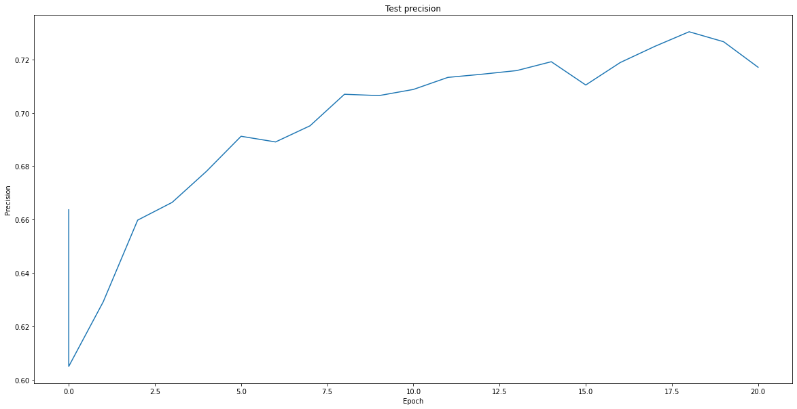
*Left: train precision, Right: test precision*

# Future Work #
I believe there is a lot more things left to try:
1. Curate sound effects dataset for all sounds important to DHH community. Bragg et al's paper did a survey of sounds important to DHH community in various environments (work, home, travel). When looking for a dataset for this project, I never found a dataset that had all the sounds I would like to classify. Curating these sounds from the sound effect libraries would result in a very useful dataset.
2. Try other data augmentation methods like mixing in background sounds and augmentation on the entire train set. It could help with the over fitting problem and class imbalance. 
3. Use the data lists of manually verified vs. not verified samples during training on Complete to weigh samples differently (i.e. importance weighting). According to the DCASE website, 60-70% of the non-verified samples are annotated accurately. Using this information during training could help model performance.
4. Many more pretrained networks exist, test this method on different architectures that are perhaps more lightweight. (See [3] and [5] in references)
5. Since time is important in audio data, recurrent neural networks could help model time relevant aspects of Audio. R-CNN hybrids exist that might be a good way to incorporate time information while using spectrograms.
6. Real world deployment is an important aspect of any SED system. The ability to classify sounds as unknown or out of training set is crucial -- a lot more work can be done in calibrating these models and also into anomaly detection.
7. Test different architectures and metrics on polyphonic data.

# References #

[1] Danielle Bragg, Nicholas Huynh, Richard E. Ladner: A Personalizable Mobile Sound Detector App Design for Deaf and Hard-of-Hearing Users. ASSETS 2016: 3-13

[2] Dhruv Jain, Kelly Mack, Akli Amrous, Matt Wright, Steven Goodman, Leah Findlater, Jon E. Froehlich: HomeSound: An Iterative Field Deployment of an In-Home Sound Awareness System for Deaf or Hard of Hearing Users. CHI 2020: 1-12

[3] Dhruv Jain, Hung Ngo, Pratyush Patel, Steven Goodman, Leah Findlater, Jon Froehlich:
SoundWatch: Exploring Smartwatch-based Deep Learning Approaches to Support Sound Awareness for Deaf and Hard of Hearing Users. ASSETS 2020: 30:1-30:13

[4] Gierad Laput, Karan Ahuja, Mayank Goel, and Chris Harrison. 2018. Ubicoustics: Plug-and-Play Acoustic Activity Recognition. In The 31st Annual ACM Symposium on User Interface Software and Technology (UIST '18). ACM, New York, NY, USA, 213-224. 

[5] Shawn Hershey Sourish Chaudhuri Daniel P. W. Ellis Jort F. Gemmeke Aren Jansen Channing Moore Manoj Plakal Devin Platt Rif A. Saurous Bryan Seybold Malcolm Slaney Ron Weiss Kevin Wilson
International Conference on Acoustics, Speech and Signal Processing (ICASSP), IEEE (2017)

# Code details #

FSD Kaggle 2018 Dataset can be downloaded here: https://www.kaggle.com/c/freesound-audio-tagging/data

TUT-SED Polyphonic Dataset can be downloaded here: https://webpages.tuni.fi/arg/paper/taslp2017-crnn-sed/tut-sed-synthetic-2016 
Note: you need to email owner to get username/password for access.

All code to preprocess .wav files and generate Mel spectrograms can be found in folder [preprocessing](preprocessing). Directory and file names have to be modified accordingly before use.

The generated Mel spec datasets can be found at the following links. Amplified, Verified, Complete and Polyphonic contain test sets as well.

Amplified: https://drive.google.com/file/d/1qaaHo06u6gxlwFXjp76o4aM9IuCt8o-3/view?usp=sharing

Verified: https://drive.google.com/file/d/1mt90E8Mlsrsir71dm2nuPi16yNRxwAKK/view?usp=sharing

Complete: https://drive.google.com/file/d/1gtwPp-geHIRJBI8m31zkGFF4vE7bQ4Ni/view?usp=sharing

Test padded: https://drive.google.com/file/d/1reWj12wXaNHBhDhsQy9o3zlVvIk50fTP/view?usp=sharing

Polyphonic: https://drive.google.com/file/d/1v6CveXuAsSPGssJXR4rm4-bpMl5PnRIG/view?usp=sharing

The tar datasets have to be uploaded to your google drive to use the given Colab notebooks. [Project.ipynb](Project.ipynb) is for single sound event detection and [Polyphonic.ipynb](Polyphonic.ipynb) for polyphonic sound event detection. 

All figures can be found under images. Full metrics from each run are in [Full Metrics.xlsx](Full%20Metrics.xlsx). The first sheet of the excel workbook lists the hyperparameters, models and dataset used for each run and corresponding serial number. 

Contact aashakad@cs.washington.edu if you have any questions. Thanks!

